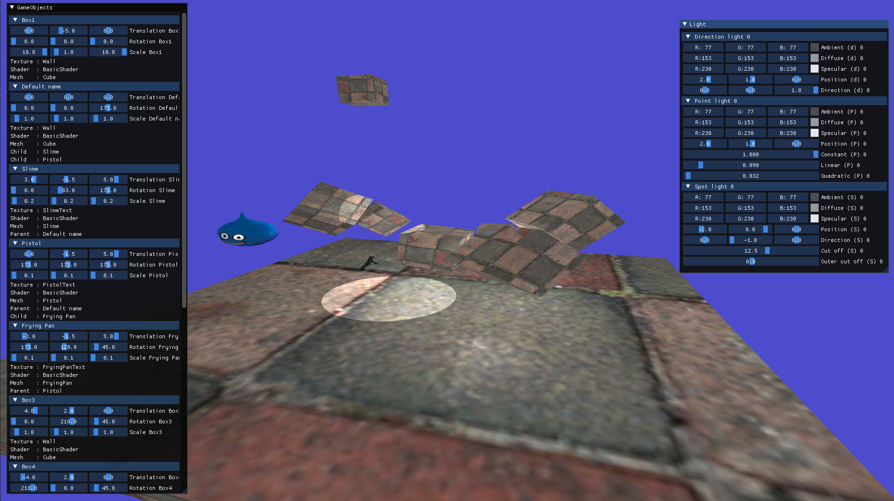
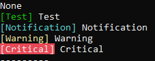
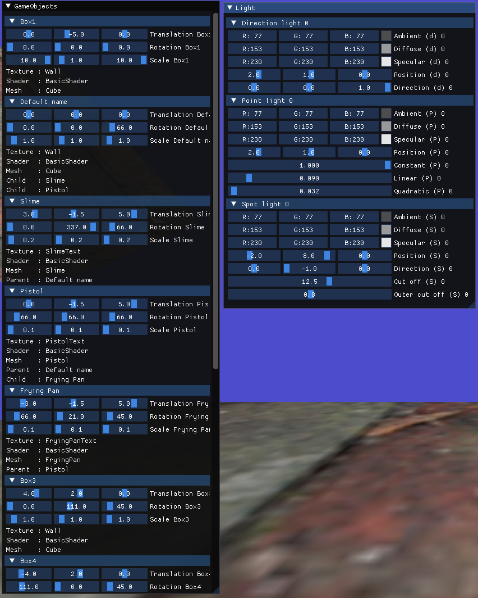
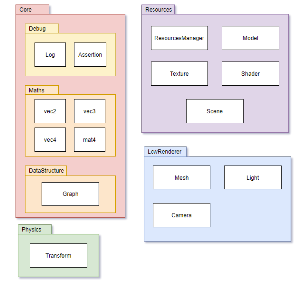

# Project Modern OpenGL
<hr />

**Authors : Vincent Devine**

For ISART Digital

<hr /><br />

## **Project description :**
Our goal was to implement the graphics architecture of a game engine.<br />
At the end, you will be able to load a 3D model on the graphics card, display it on the screen, and apply visual effects to it by means of small graphic programs designed for this purpose: shaders.

## To build and run the project : 
Open the project in Visual Studio and start this (F5).
<br /><hr />


## **Commands :**
- W/S : Move forward/backward
- A/D : Move left/right
- Shift/Spacebar: Move up/down
- Mouse : Look in a direction 
- Right click : Lock mouse in windows
<br /><hr />

##  **Debug**
- Open/Close a log file
- Print : print message in the console and in the log file (if open). Choose the log level
- DEBUG_LOG : print file name, function name and line number and message with print function and in debug console of visual studio.
- Assertion : own assert who use own debug function (in Debug mode, don't abort but make a breakpoint)


<br /><hr />

##  **Maths**
- Vec2 / Vec3 / Vec4
- Mat4 (Matrix 4x4)
- test of own math lib with OpenGL mat lib
- Class Transform with 3 Vec3 (Translation, Rotation, Scale) and 1 Mat4 (Model matrix)
<br /><hr />

##  **Resource Manager**
- Used to store all resources (mesh, texture, shader, scene) with name for id
- Create a resource
- Get by name
- Delete by name
<br /><hr />

##  **OBJ Parser**
- Parse file in .obj extension and storage VBO (vertex : position, normal, uv) and EBO (index of VBO)
- Don't create duplicate vertex
<br /><hr />

##  **Differents resources**
- Resource :
    - Attribute : name (id), and path (to data, ex : Wall.jpg)
    - Methode : Init data in OpenGL, Update/Draw resources
- Mesh : has data of the 3D model (by OBJ Parser)
- Texture : has data of the texture applied to the Mesh
- Shader : composed by 1 vertex shader and 1 fragment shader and link it
- Scene : Store all data of 1 scene (GameObject, Light, Camera, SceneGraph)
<br /><hr />

##  **Model**
- Composed of :
    - 1 pointer to Mesh (get by the resource manager)
    - 1 pointer to Texture (get by the resource manager)
    - 1 pointer to Shader (get by the resource manager)
- Represents 1 object
<br /><hr />

##  **GameObject**
- Composed of :
    - 1 Model
    - 1 Transform
    - 1 name (id)
- Represents 1 object in game
<br /><hr />

##  **Camera**
- The camera can move with inputs (see above)
- Used to create view and projection matrix
<br /><hr />

##  **Light / Light Manager**
- Light was create by the Blinn-Phong algorithm
- 3 type of light :
    - Directional Light
    - Point Light
    - Spot Light
- Only 5 light of each type
- Send data to shader
<br /><hr />

##  **SceneGraph**
- Composed of :
    - Vector of node
    - 1 pointer of the GameObject list 
- Node is composed of :
    - 1 index to its GameObject 
    - 1 index to the node's parent (-1 if they don't have)
    - 1 index vector to its child
- Give the parent's transform (model matrix) to its child
- The scene is used to call Update and Draw function of all GameObjects (to get the good order of call : parent -> child -> ...)
<br /><hr />

##  **ImGui**
- left window : list of all GameObject in the scene.
    - Change its Transform (Translate, Rotation, Scale)
    - Show object's data (texture, shader, mesh)
    - if GameObject has parent and/or child, see their name
- Right window : list of all Light in the scene
    - Change color of the light (Ambient, Diffuse and Specular)
    - Change position of the light
    - Change data specific to the light (directional, point, spot)  


<br /><hr />

##  **Feature to add**
- Optimize OBJ parser
- Parse obj with material, multiple mesh and texture
- Hash data after data parsing
- Shadow
- Upgrade of ImGui (drag and drop of GameObject to set the parent, create GameObject)
<br /><hr />

## **Architecture**
```sh.
│   Log.txt
├───DLL
├───Headers
│   │   App.hpp
│   │   Assertion.hpp
│   │   Camera.hpp
│   │   GameObject.hpp
│   │   Graph.hpp
│   │   InputsManager.hpp
│   │   IResource.hpp
│   │   Light.hpp
│   │   LightManager.hpp
│   │   Log.hpp
│   │   Mesh.hpp
│   │   Model.hpp
│   │   MyMaths.hpp
│   │   OBJParser.hpp
│   │   ResourcesManager.hpp
│   │   Scene.hpp
│   │   Shader.hpp
│   │   TestMyMaths.hpp
│   │   Texture.hpp
│   │   Transform.hpp
│   └───Imgui
│
├───Includes
├───Libs
├───Resources
│   ├───Obj
│   │       cube.obj
│   │       c_pistol.obj
│   │       frying_pan.obj
│   │       quad.obj
│   │       Slime.obj
│   │ 
│   ├───Shaders
│   │       FragmentShaderSource.frag
│   │       VertexShaderSource.vert
│   │
│   └───Textures
│           c_pistol.png
│           frying_pan.png
│           sample.png
│           sample2.png
│           Slime.png
│           wall.jpg
│
├───Sources
│   │   App.cpp
│   │   Camera.cpp
│   │   GameObject.cpp
│   │   glad.c
│   │   Graph.cpp
│   │   InputsManager.cpp
│   │   Light.cpp
│   │   LightManager.cpp
│   │   Log.cpp
│   │   main.cpp
│   │   Mesh.cpp
│   │   Model.cpp
│   │   MyMaths.cpp
│   │   ResourcesManager.cpp
│   │   Scene.cpp
│   │   Shader.cpp
│   │   TestMyMaths.cpp
│   │   Texture.cpp
│   │   Transform.cpp
│   └───Imgui
└───stb-master
``` 
Namespace architecture :



<br /><hr />
Code editor : Visual Studio Community <br />
System : Windows